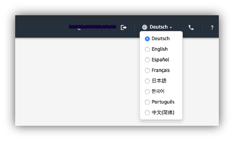
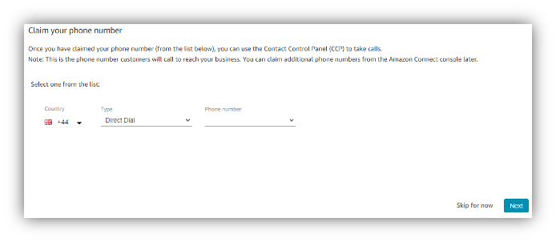

# Connect instance
## Create your Amazon Connect instance:

1. Go to the Amazon Connect panel in the console (make sure you’re using the **London** region).

### Add a new instance by clicking on **Get Started**

2. Ensure your Connect instance is identifiable by adding your initials `connect-builders-day-<initials>` (Initials used in case of shared account)

3. Create an administrator “Admin” with password

4. Default settings for Telephony Options & Data storage

### And

5. Create instance

### You should see

### And eventually

**Connect Access:**
`https://<your instance name here>.awsapps.com/connect/login`

**AWS console Accesss**
`https://eu-west-2.console.aws.amazon.com/connect/home`

## Set-up your Amazon Connect instance:

1. Now that your Connect instance has been created, we are going to configure it. Click **Get Started**

2. Change language settings from “Deutsch” to “English” at the right top under settings

3. Select “Let’s go” to start configuring a phone number, if asked by Chrome browser “Allow” connect any access to “Microphone” and “Notifications”.

4. Select country “United Kingdom” and “Direct Dial” for type of phone number and select one of the available numbers from the drop-down list.

5. Click **Next**

6. Congratulations you have configured your Amazon Connect Contact Centre within 5 minutes. Let’s see if we can accept phone calls.

7. Dial your phone number and select option 1 when asked to make your very first phone call. And accept the call on the right side of the screen in the CCP

## Configure Hours of Operation, Queues, Routing Profiles and Agents:

1. Familiarize yourself with the 4 different menu options on the left-hand side of the screen. Dashboard/Metrics and Quality/Routing/Users

After the dashboard you have:

2. Under the “Routing” tab navigate to “Hours of operation” to start configuring the opening hours of our Contact Centre

3. **Add new hours**

4. Create new opening hours named “General Hours”, select “Europe/London” time zone and add a description. Our contact center will be open Monday to Friday from 9am to 5pm, set times accordingly.

5. **Save**

6. Under the “Routing” tab navigate to “Queues” to start configuring the queues of your Contact Centre

7. **Add new queue**

8. Create a new queue named “General Queue” and add a description.

9. Hours of operation: Select our newly created Hours of Operation from previous step.

10. Outbound caller ID name: “Playground”.

11. Outbound caller ID number: Select the phone number created previously.

12.	The rest of the settings are optional and out of scope for this stage.

13.	**Add new queue**

14.	**Repeat step 7-13** to create 1 additional queues for “Premium Queue”.

15.	Under the “Users” tab navigate to “Routing Profiles” to start configuring the routing profiles of your Contact Centre

16. **Add new profile**

17. Create a new routing profile named “Premium Agents”, add a description & select Voice under channels and concurrency

18.	Add the 3 queues we created in the previous step with the following priority and delay settings

19.	Set default outbound queue to “Basic General”.

20.	**Add new profile**

21.	Repeat steps 17-19 to create an additional profile for “Basic Agents” with both basic queues and priority set to 1 with 0 delay. Select Voice under channels and concurrency for both

22.	Under the “Users” tab navigate to “User management” to start configuring the agents of your Contact Centre.

23.	**Add new users**

24.	**Next** to create “AgentOne”.

25.	Enter dummy agent personal details (you will need it later on).

26.	Routing profile: “Premium Agents”

27.	Security Profiles: “Agent”

28.	**Save**

29. **Create Users**

30.	**Create more users** to create “AgentTwo” with routing profile “Basic Agents”.

