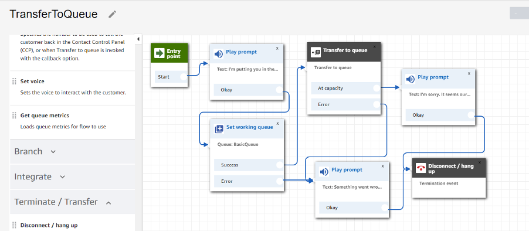
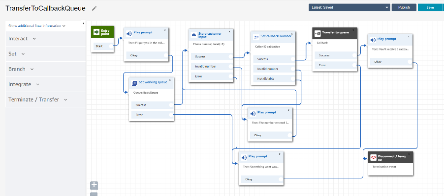
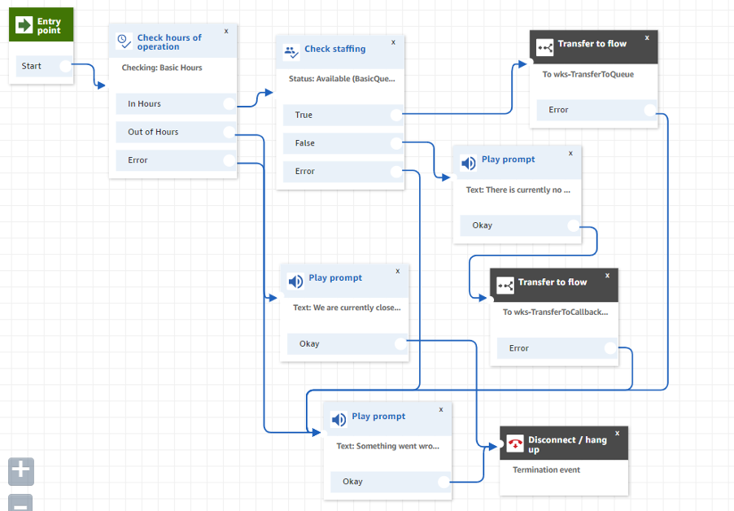

# Creating contact flows
## Creating your First Contact Flow:
1. Navigate to Routing -> Contact Flow

2.	Select create contact flow.

3.	Enter the name TransferToQueue.

4.	Under Interact, add a Play prompt module and link it to Entry point.

5.	Click into the module, select Text to speech and enter the text "I'm putting you in the queue".

6.	Under Set, add a Set working queue module and link it to the Play prompt module.

7.	Click into the module and select the BasicQueue.

8.	Under Terminate/Transfer add a Transfer to Queue module and link it to the Success option of the Set working queue module.

9.	Add two more Play prompt modules. Make one say "Something went wrong. Please Try again later" and the other "I'm sorry. Our queue is at capacity. Please Try again later".

10.	Link the error message to the Error options on set working queue, Transfer to Queue, and the at capacity message.

11.	Under Terminate/Transfer, add a Disconnect/Hang up module and link your final messages to it.

12.	Save and then publish.

### Once done the contact flow should looks as below:

## Creating a CallBack Contact Flow:

1.	Under Routing, select Contact Flows.

2.	Select create contact flow.

3.	In the upper right next to the Save button, select Import flow (beta).

4.	Upload the TransferToCallbackQueue file from the contact-flows folder in the repository.

5.	Modify the Set working queue module to select the BasicQueue and save.

6.	Click through the modules to understand how the pieces work together.

7.	Save, Publish, and test the TransferToCallbackQueue contact flow like your TransferToQueue contact flow. Notice that when connected using the callback queue, the caller heard the Default outbound contact flow.

### Once done the contact flow should looks as below:

## Creating Call Router Contact Flow:

1.	Under Routing, select Contact Flows.

2.	Select create contact flow.

3.	Enter the name InboundCallRouter.

4.	Under Branch, select Check hours of operation. Select Basic Hours.

5.	Build out the Error flow with error message and termination.

6.	Under Branch, select Check staffing. Under Status to check, select Available. Optionally select the basic queue. Link this module to Check hours of operation's In Hours module. Link the error option.

7.	Under Terminate/Transfer, select Transfer to flow. Select your TransferToQueue contact flow and save. Link this to the True output of Check Staffing and the error path.

8.	Add a Play prompt module that says "There is currently no one ready to accept your call. Let me put you in the callback queue so you don't have to wait on hold" and link this to the False output of Check Staffing.

9.	Under Terminate/Transfer, select Transfer to flow. Select your TransferToCallbackQueue contact flow and save. Link this to your prompt and the error path.

10.	Add a Play prompt module that says "We are currently closed. Please call again later." Link this to the Out of Hours option and terminate.

11.	Save, Publish, and Update your phone number's Contact Flow.

12.	Now you can test how the caller is routed when you are Available or Unavailable in the CCP. Similarly, if you can change the Basic Hours of operation to see how users are routed.

### Once done the contact flow should looks as below:

[Next: Lex Bots](chapter-3.md)

[Back to the main page](../README.md)