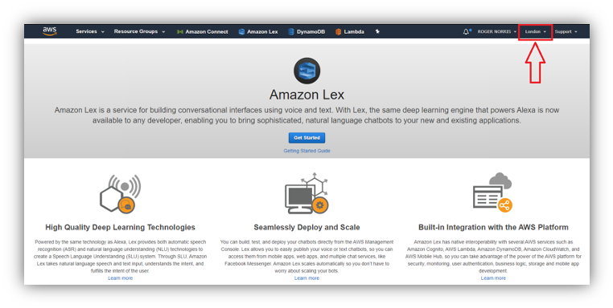
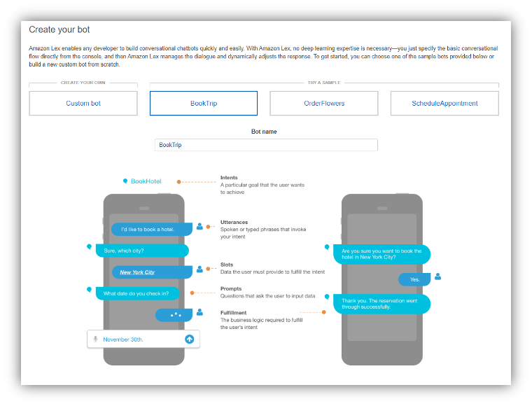
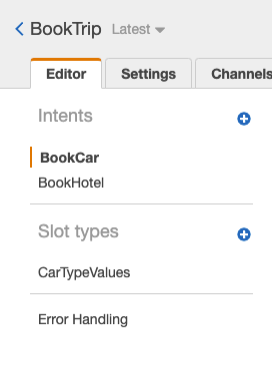
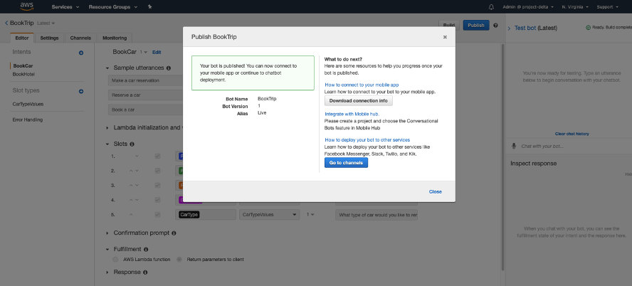
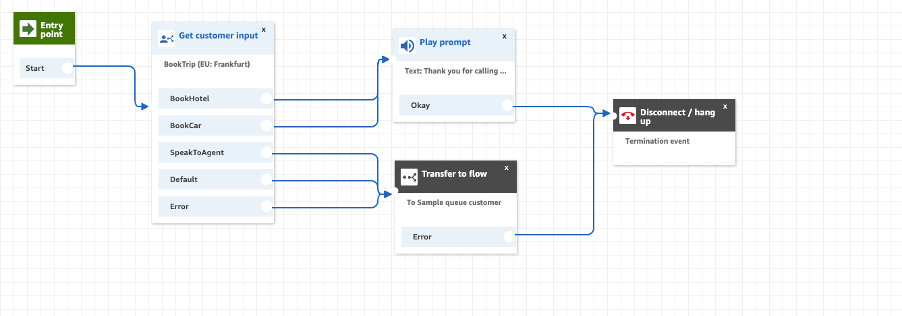

# Lex Bots
## Create Lex Bot (Intents & Utterances)

1. Go to the **Amazon Lex** panel in the console (make sure you are using the London region).

2. Click **Get Started** and you will see the below:

3. Select **Book Trip** Bot: 

4.	Once the Bot is created, it will have couple of **Intents** which are **BookCar & BookHotel**.

5.	It will also contain Slots which asks question around City, Number of Nights, Check-In Day and Room Type as shown below.

6.	Confirmation Prompt will be configured too, it will look as below.

7.	Click on Build in the top right-hand corner. 

8.	Once the build is ready, Test Bot will be displayed on the right-hand side of the browser, if the Test Bot panel is not displayed please click Test Bot button. 

9.	Test the Bot with different Utterances that are configured within each intent. 

10.	You can make more changes to the Bot and add utterances to it as you see fit. 

11.	When the Bot is fully tested, we can Publish it, by clicking Publish Button on the top right-hand corner. 

12.	Create Alias “Live” and Publish bot

### Once Complete, you will see:

## Add Lex to Connect Instance:

To use a bot in your contact flow, add the bot to your Amazon Connect instance. You can only add bots created under the same AWS account and in the same Region as your instance.

1.	Open the Amazon Connect console.

2.	Select the **Instance Alias** of the instance to which to add the bot.

3.	Choose **Contact flows**.

4.	Under **Amazon Lex**, choose + **Add Lex Bot**.

5.	Select the **BookTrip** bot and choose **Save Lex Bots**. If you published the bot after you opened the settings for your instance, reload the page to get it to show up.

# Contact Flows
## Create Contact Flow for Lex Bot:

1.	Go to the Amazon Connect panel in the console (make sure you’re using the London region).

2.	Navigate to your instance settings

3.	**Login as administrator**

4.	Under the “Routing” tab navigate to “Contact Flows” to start importing the downloaded contact flows.

5.	**Create contact flow**

6.	Under **Interact**, drag a **Get customer input** block onto the designer, and connect it to the Entry point block.

7.	Open **Get Customer input** block, and choose **Text to Speech (Ad Hoc), Enter Text**.

8.	Type the message that provides caller with the information, for example: “Welcome Acme booking service, to book a car please say Book a car or to book a hotel please say Book a hotel”.  The message needs to be relevant to the intents in the Lex Bot and Utterances that those intents need to identify how the call will be dealt with.

## Add the Amazon Lex bot to your contact flow

1.	In **Get Customer Input** Block, select **Amazon Lex**

2.	For **Name**, use **BookTrip**. For Alias, use **Live**

3.	To specify the **intents**, choose **Add a Parameter** under **Intents**

4.	Type --------, and choose **Add Another Parameter**

5.	Type **SpeakToAgent** and Choose **Save**.

## Finish the contact flow

1.	If the caller says to book a hotel or car, use a **Prompt** block to play a message and disconnect the call.

2.	If the says speak to an agent, use a **Transfer to flow** block to set the queue flow and transfer the caller to the queue, which ends the contact flow.

## To complete, BookHotel or BookCar:

1.	Under Interact, drag a **Play Prompt** block to the designer, and connect the **Both** Nodes of **Get Customer Input** block to it. After the customer book their hotel or car from the Amazon Lex bot, the message in the **Play prompt** block plays.
2.	Under **Terminate/Transfer**, drag a **Disconnect / hang up** block to the designer, and connect the Play prompt block to it. After the prompt message plays, the call is disconnected.

## To complete, SpeakToAgent:

1.	Add a **Set queue** block and connect it to the **SpeakToAgent** node of the **Get customer input** block.

2.	Add a **Transfer to flow** block and connect the **Error** node to **Play Prompt**. Select the **TransferToQueue** Flow from the drop list of **Transfer to flow** block.

3.	Under Interact, drag a Play Prompt block to designer and connect to Disconnect/ hang up. After prompt message plays, the call is disconnected.

### Final Contact Flow for Lex should look as below:

## Assign Contact Flow to a Number:

1.	Open Amazon Connect Dashboard

2.	Choose View Phone Numbers

3.	Select the phone number we claimed when setting up the connect instance in 1 module.

4.	Add a description.

5.	In the Contact Flow/IVR menu, choose the contact flow that you have just created.

6.	Choose Save. 

# That is it for today - Thanks a lor for joining us!

[Back to the main page](../README.md)